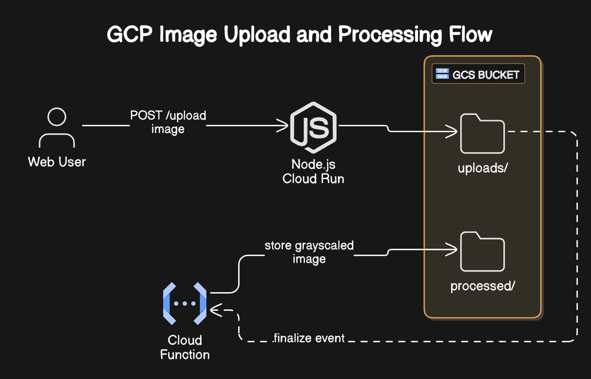

This project demonstrates an end-to-end image upload and processing pipeline using:
- **Node.js + Express** for backend API
- **Google Cloud Storage (GCS)** for image storage
- **Google Cloud Functions** for image processing (resize)
- **Sharp** for image manipulation

#### Steps

1. GCP Account setup & required API enabled
2. Create cloud storage bucket
3. Create client node js code
4. Create cloud function code & deploy it as function in the gcp

#### clean up
1. delete deployed function and dependent resource
2. delete other resources if deployed any.

#### Note: 
Tech blog step by step & video coming soon... :)